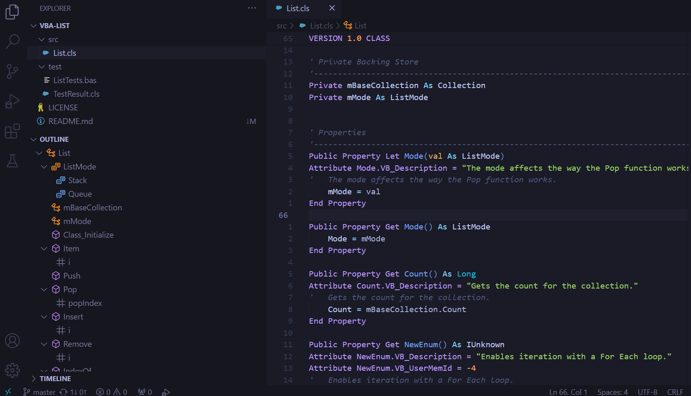

<p align="center">
	
</p>

# VBA Pro Extension for VS Code

Provides Visual Basic for Applications (VBA) language support in Visual Studio Code using a Language Server Protocol (LSP) compliant backend. We all know that VBA is a dinosaur from the '90s, but it doesn't have to feel like one.



## Features

* Syntax highlighting
* Semantic highlighting
* Folding ranges
* Code Snippets
* Icon theme
* Document symbols
* Document diagnostics
* Document formatting<sup>1</sup>
* Auto-completion (IntelliSense)<sup>2</sup>

<sup>1</sup>Currently full document `Shift+Alt+F` formatting only.
<sup>2</sup>Suggests module members and in-scope names. Supports `.vbatype` ambient declaration files for external/DLL APIs.

### Auto-Completion (IntelliSense)

The extension provides IntelliSense completions for VBA code:

- **Member access**: typing `MyModule.` suggests the public members (functions, subroutines, properties, types) of that module.
- **In-scope names**: in any other context, all names visible from the current module are suggested (locals, module members, public names from sibling modules, and ambient declarations).

#### `.vbatype` Ambient Declaration Files

Similar to TypeScript's `.d.ts` files, `.vbatype` files let you describe external APIs (e.g., DLL functions imported via `Declare` statements) using standard VBA module syntax. Place them anywhere in your workspace and the LSP will parse them into an ambient scope that feeds completions without producing diagnostics in your project.

Example `Win32API.vbatype`:
```vba
Attribute VB_Name = "Win32API"

Public Declare Function GetTickCount Lib "kernel32" () As Long
Public Declare Sub Sleep Lib "kernel32" (ByVal dwMilliseconds As Long)
```

After saving this file, typing `Win32API.` will suggest `GetTickCount` and `Sleep`.

### *PREVIEW* Definition Provider

This extension now supports definitions, i.e., following a name to a declaration. Pressing F12 will jump you to the relevant method or variable declaration.

This is a preview feature and may not work 100% as expected. If bugs are encountered, please take the time to raise an issue on the repo.

### *PREVIEW* Code Refactoring

This extension now supports Rename requests, i.e., using F2 to rename an element. It will find the all instances of the name throughout the workspace and rename it.

### Preview Limitations

Known limitations:
 - Method attributes (yet) aren't renamed when  you rename a function or sub.
 - Public methods still producing diagnostics when there's a similarly named method in another module.
 - Can't yet rename classes with this functionality.

### Web Support

The VBA Pro Extension offers limited support for web environments (e.g. vscode-dev).
This includes syntax highlighting and snippets.

### Syntax Highlighting

The most complete and bug-free TextMate grammar for VBA out there.

### Semantic Highlighting

TextMate does a great job with syntax highlighting but there are some things it can't know. Semantic highlighting is resolved by the language server and helps support where context is required.

### Folding Ranges

Folding ranges help organise code, collapsing things out of the way when you don't need to be looking at them.

### Code Snippets

A small but growing collection of highly useful code snippets. The idea is to keep these to a "rememberable" level, but if there's something you use all the time and you think it's missing, I'd love to hear from you.

### Icon Theme

VS Code supports two ways of contributing icons.
* Per language identifier. Limited to one icon for all file types.
* Icon pack. Allows more flexibility, however, only one icon theme can be active at any time.

This extension provides both methods. Users with no icon pack installed can use the icon pack provided by this extension to see a visual difference between classes, modules, and forms. Users who prefer to use an alternative icon pack can fall back to the language assigned icon.

### Document Symbols

Document Symbols allow you to view a structured outline of your code in the VS Code Outline view and breadcrumbs. These make it easy to understand and navigate files.

### Document Diagnostics

Displays warnings and errors in the Problems panel, as well as underlining the relevant sections in your code. Only a few diagnostics have been implemented to date, however these will be fleshed out over time.

## Document Formatting

Whole of document formatting is supported with `Shift+Alt+F`. Keeps your code properly indented and easy to read. Also supports half indentation for conditional compilation logic and the complexities that come with it.

```vba
#If VBA7 then
  Public Property Get Foo() As LongPtr
#Else
  Public Property Get Foo() As Long
#End If
	Foo = 0
End Property
```

## Coming Soon

* Hovers

## Installation

* Through the [VS Code Marketplace](https://marketplace.visualstudio.com/items?itemName=NotisDataAnalytics.vba-lsp),
* VS Code command palette `ext install notisdataanalytics.vba-lsp`, or;
* Download the [visx](../../releases/latest).

## Contributing

Contributors welcome! Please see [contributing.md](/contributing.md).
